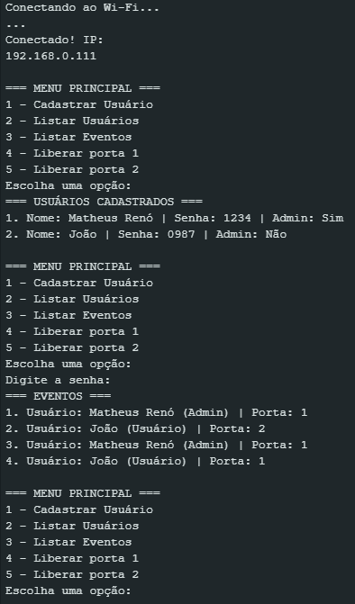

# Gerenciamento de Acesso com FreeRTOS

Sistema de controle de acesso a salas utilizando Arduino (ESP32), FreeRTOS e webserver.  
**Repositório**: [github.com/RennowT/gerenciamento-acesso-freertos](https://github.com/RennowT/gerenciamento-acesso-freertos)
[Vídeo Demonstrativo](https://www.youtube.com/shorts/kNBmgsdysVw)

---

## Funcionalidades
- **Cadastro de Usuários** via interface serial
- **Controle de Portas** com autenticação por senha
- **Registro de Eventos** em memória Flash
- **Webserver** para controle remoto das portas
- **Timeout Automático** de 5 segundos para fechamento
- **Listagem Administrativa** de usuários e eventos

---

## Hardware
- Placa **ESP32** (com WiFi integrado)
- 2 LEDs (para simular as portas)
- 2 botões (para fechamento manual)
- **Esquemático**:
  ```
  Porta 1: LED -> GPIO13 | Botão -> GPIO26
  Porta 2: LED -> GPIO14 | Botão -> GPIO25
  ```

---

## Desenvolvimento
### Arquitetura
- **FreeRTOS** com 3 tasks:
  1. `TaskMenu`: Gerencia a interface serial e cadastro
  2. `TaskFlash`: Armazena dados na memória Flash
  3. `TaskWebServer`: Controla o servidor web

- **Comunicação**:
  - Fila FreeRTOS para transferência de dados entre tasks
  - Semáforos para controle de acesso concorrente

### Dependências
- Bibliotecas:
  - `AsyncTCP-esphome@2.1.4`
  - `ESPAsyncWebServer-esphome@3.3.0`
- Framework: `Arduino (esp32@2.0.0)`

---

## Instalação
### Via PlatformIO (Recomendado)
1. Clone o repositório:
   ```bash
   git clone https://github.com/RennowT/gerenciamento-acesso-freertos
   ```
2. Abra o projeto no VSCode com PlatformIO
3. Conecte o ESP32 via USB
4. Compile e faça upload:
   ```bash
   pio run --target upload
   ```

### Via Arduino IDE
1. Instale as bibliotecas via *Library Manager*:
   - `AsyncTCP-esphome`
   - `ESPAsyncWebServer-esphome`
2. Faça upload do código para a placa

---

## Uso
### Interface Serial (115200 baud)
```
=== MENU PRINCIPAL ===
1 - Cadastrar Usuário
2 - Listar Usuários
3 - Listar Eventos
4 - Liberar porta 1
5 - Liberar porta 2
```

### Webserver
1. Conecte-se ao IP exibido no Serial Monitor
2. Controle as portas via botões na interface web:
   ```
   http://[IP-DO-ESP32]/
   ```

---

## Estrutura do Repositório
```bash
images/                    # Galeria de imagens
├── controle_remoto.png
├── hardware_1.jpeg
├── hardware_2.jpng
└── serial_monitor.png
PIO-Gerenciador-Acesso/
├── .vscode/               # Configurações específicas do VSCode
│   └── extensions.json    # Extensões recomendadas
├── include/               # Headers (se necessário)
├── lib/                   # Bibliotecas customizadas (se necessário)
├── src/                   # Código-fonte principal
│   └── main.cpp           # Arquivo principal
├── test/                  # Testes unitários (se necessário)
├── platformio.ini         # Configuração do PlatformIO
└── .gitignore             # Arquivos ignorados pelo Git
.gitignore                 
LICENSE                    # Licença do projeto
README.md                  # Documentação principal
```

---

## Galeria de Imagens

### Hardware


### Interface



---

**Nota**: Projeto desenvolvido como parte de desafio técnico para PD Soluções.
